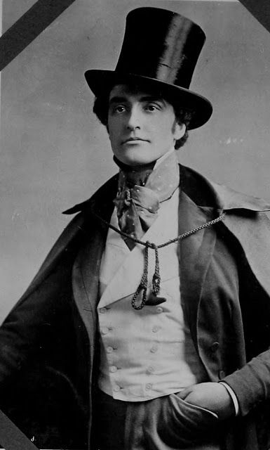

Havardr Folke - Nam 21 tuổi




Nghề hiện tại: Lao động trong hiệu sách nhỏ tại địa phương.

Đặc điểm - Trait: 
	- Mọt sách
	- Tri thức
	- Ham học hỏi
	- Sinh ra trong gia đình trung lưu tri thức, khá giả.
    - Đồng cảm với nổi khổ của thường dân, nhân dân lao động. 
	- Ghét hoàng gia quý tộc: bọn chúng sống xa hoa trong khi thường dân sống bần cùng
	- Vô thần, không tin vào chúa, chúa không có thật. 

	
Quan niệm - Idea:
	- Ta có thể làm gì để giảm bớt nỗi khổ của nhân dân lao động ?

Ràng buộc - Bond:
	- Ngài [[Mr. Cato Galenus]], chủ tiệm sách nơi tôi làm việc đã chỉ dạy tôi rất nhiều.

Khuyết điểm - Flaw:
	- Dù đồng cảm với nỗi khổ của chúng sinh, nhưng lại không quen chịu khổ. 
	- Vì sinh ra ở gia đình trung lưu trí thức, nên chưa nếm mùi bần cùng của những người ở đáy xã hội.
	- Vô thần, đéo tin chúa có thật  
	- Suy nghĩ thực dụng, vật chất

--------------
```
Feedback 2021-10-29 
Quote: 
Có… tất cả địa danh, thành phố lớn ôg đều biết được, nhưng ko hiểu vì sao ko có nghĩ đến “bản đồ”

Túm lại có các thành phố lớn: 
-Thủ đô Arama, phía Nam tuyến đường sắt có: Ariel, Kinne; 
-Phía Bắc tuyến đường sắt có: Thành phố Khoáng sản, tuyến đường sắt phía 
-Đông có: Tháp phía Đông và ở phía Bắc của Tháp phía Đông là Thành phố Nhất; Tuyến đường sắt phía Tây có Tháp phía Tây

Bối cảnh đang xảy ra là ở thủ đô á

Phía Tây Nam Thủ Đô có một cái hồ cực bự, ờm… gần như dạng biển hồ vậy, gọi Hồ Trăng Lớn (hay Đại Nguyệt nếu ôg thích tên Hán Việt, cũng có khu sinh hoạt bao vòng quanh chia 4 khu Đông Nam Tây Bắc

Vả lại, ôg ko tính viết chi tiết về gia đình á? Ví dụ tên cha mẹ… hay có anh chị em gì ko? Còn Cato Galenous nhìn bề ngoài bao nhiêu tuổi vậy? Vì t chưa nhận ra được trong backtory của ôg có lý do cho thanh tra của sở cảnh sát tìm đến ông gòi mời kết nạp vào Tổ điều tra Nếu ôg ko có ý kiến, hay t để… Ngài Cato Galenous giới thiệu/đề cử cho bên cảnh sát về ôg nhé? Còn lý do, thân thế của ôg Cato… ôg chưa biết
```
===========================

Haverdr sinh ngày 1/1/757 trong một gia đình trung lưu trí thức. 
Bố là [[Mr. Truman Folke]],  mẹ là [[Mrs. Cerelia (Winifred) Folke]]. Cà 2 đều làm vị trí điều hành trong công ty [[Company name here]] - một công ty trong thành phố Khoáng Sản.


Từ khi lên 5, Haverdr được ông già nhà gửi gắm tại nhà thờ thánh Gerstahl, một nhà thờ nhỏ ở rìa đông nam, thành phố Khoáng sản, để cậu được học tập và rèn luyện ý chí. Tại đó cậu học chữ, đọc viết, học kinh thánh, khoa học xã hội. Thực ra, nhà thờ coi tàn nhưng không phế. Điều kiện ăn mặc trong nhà thờ ở vẫn ngon lành hơn rất nhiều so với công nhân quèn tại khu căn hộ gần đó.

Cuộc sống kham khổ tại nhà thờ, gần khu nhà máy đã giúp cậu đồng cảm với công nhân lao động. Những công nhân nhà máy làm quần quật hơn 12 tiếng mỗi ngày, nhưng thu nhập chỉ vừa đủ ăn, đủ ở trong căn hộ 4 mét vuông. Y tế còn là một thứ xa xỉ. Khi một công nhân bị tai nạn tàn phế, hay quá già, họ sẽ sống nhờ vào sự rộng lượng của hàng sớm, và nhà thờ. Nhưng mà nhà thờ cũng nghèo vcl ra (không biết thu nhập của nhà thờ đến từ đâu nữa, ... chưa nghĩ ra, dân xung quanh nghèo vcl).

Cậu đã sớm bộc lộ năng khiếu tư duy hùng biện, và nhận ra sự không thống nhất giữa kinh thánh và hiện thực. Cậu đã có lần tư duy như sau 

```
Các mục sư đã dạy: 
- Chúa là đấng toàn năng
- Chúa là người tốt

Thế nhưng, ở thực tại: 
- Cuộc sống con người vất vả, lam lũ. 

Nếu như chúa là đấng toàn năng: 
- Chúa sẽ nhận biết được rằng nhiều người sống khổ cực lam lũ
- Chúa hoàn toàn có năng lực để cải thiện đời sống con người 

Nếu chúa là người tốt và biết nhiều người đang lam lũ, cùng cực: 
- Chúa sẽ giang tay cứu thế

Khi cả 3 điều này đúng: 
- Chúa có thật
- Chúa là người tốt
- Chúa là đấng toàn năng 

Thì ta sẽ không còn thấy cảnh bần cùng, lam lũ của công nhân nhà máy. Nhưng mà ta vẩn thấy người kia vẫn đang nếm trải bần cùng. Vậy thì ... có ít nhất một điều không đúng. 
```

Bằng cách nào đó, cậu nhận ra rằng, cách tốt nhất là đừng nói cái này cho ai biết hết. Nhưng đức tin của cậu dành cho chúa đã dần dần biến mất kể từ ngày này. 


--------

Năm 13 tuổi, (năm 770), cậu trở thành nhân viên tại hiệu sách Brightwood [[Bookstore-Brightwood]]. Brightwood là hiệu sách mà ngày cuối tuần cậu thường lui tới. Khi gặp khó khăn, cậu gặp chủ hiệu sách là ông [[Mr. Cato Galenus]], một quý ông thông thái và điềm tĩnh, để nhờ giản giải. 

Làm tại đây một thời gian, cậu tìm được cuốn sách Tuyên ngôn của Đảng cộng sản, của tác giả _redacted_. 

Cuốn sách nói về một thế giới đại đồng, một thế giói không phân chia giai cấp, không phân biệt giàu nghèo, không tồn tại tôn giáo. Tại đây, mọi người lao động hăng say, nhưng không phải vì đồng lương sống qua ngày, mà vì họ yêu lao động. Quả thật, tư tưởng cộng sán, trong xã hội cộng sản, thì sẽ không có cảnh công nhân lao động lam lũ vất vã nhưng lại phải sống vất vưỡng qua ngày.

Sau khi Havardr tìm thấy cuốn sách và đọc ngấu nghiến tầm 1 tháng, thì ông [[Mr. Cato Galenus]], chủ hiệu sách, gặp cậu và cùng thảo luận về nội dung trong sách ...


